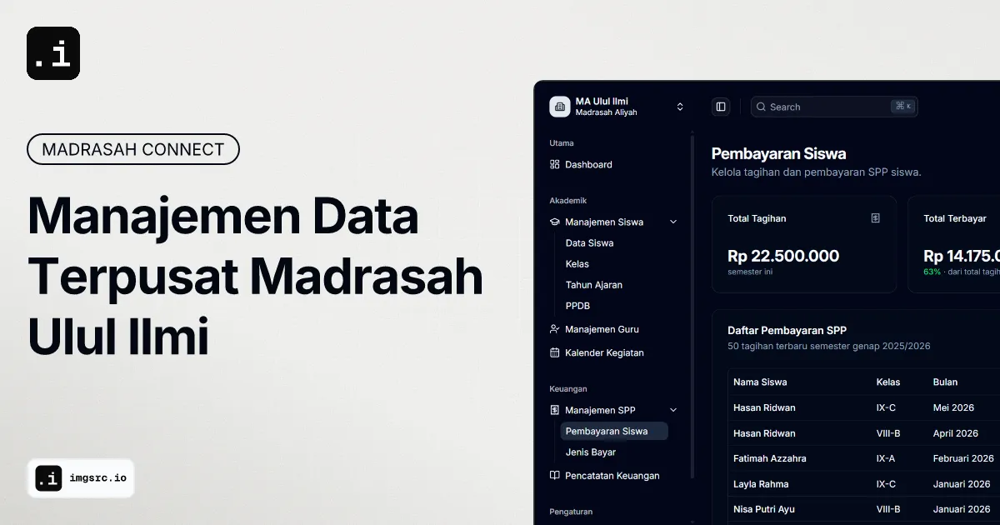

# Madrasah Connect Admin Dashboard

Admin Dashboard UI crafted with Shadcn and Vite. Built with responsiveness and accessibility in mind.



> [!NOTE]
> This is a modified, adapted, and integrated to the context of [Ulul Ilmi Islamic Boarding School](https://ululilmi.sch.id/) by [Abdul Hakim](https://github.com/alarwasyi98)

> [!SEE ALSO] [Original Template](https://github.com/satnaing/shadcn-admin)

## Tech Stack

- **UI:** [ShadcnUI](https://ui.shadcn.com) (TailwindCSS + RadixUI)
- **Build Tool:** [Vite](https://vitejs.dev/)
- **Routing:** [TanStack Router](https://tanstack.com/router/latest)
- **Type Checking:** [TypeScript](https://www.typescriptlang.org/)
- **Linting/Formatting:** [ESLint](https://eslint.org/) & [Prettier](https://prettier.io/)
- **Icons:** [Lucide Icons](https://lucide.dev/icons/), [Tabler Icons](https://tabler.io/icons) (Brand icons only)
- **Auth (partial):** [Clerk](https://go.clerk.com/GttUAaK)

## Run Locally

```bash
  git clone https://github.com/alarwasyi98/sims-admin.git
```

```bash
  pnpm install
```

## License

Licensed under the [MIT License](https://choosealicense.com/licenses/mit/)
